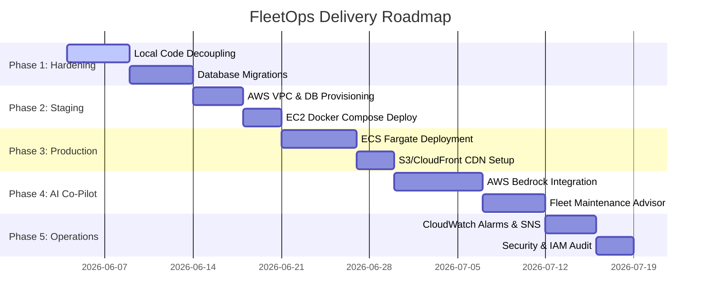

# 🗺️ FleetOps Enterprise — Next Phases Roadmap

This document outlines the strategic plan and step-by-step phases to move FleetOps from its current local containerized state to a secure, highly scalable cloud environment, complete with the planned Amazon Bedrock AI integration and operational monitoring.

---

## 📅 Roadmap Overview

---

## 🛡️ Phase 1: Local Code Refinement & Hardening (Staging Prep)
*Focus: Stabilizing configurations, securing credentials, and preparing databases for persistent cloud environments.*

1.  **Decouple Secrets from Application properties:**
    *   Ensure no Spring Boot properties files contain hardcoded database passwords or JWT secrets.
    *   Verify all credentials reference environment variables (`${DB_PASSWORD}`, `${JWT_SECRET}`) so they can be injected by AWS Secrets Manager.
2.  **Add Database Schema Migration Tools:**
    *   Integrate **Flyway** or **Liquibase** into all Spring Boot services.
    *   Move database definitions away from `hibernate.ddl-auto: update` (which is prone to schema drift in production) to version-controlled SQL migration scripts.
3.  **Refine Logging Output:**
    *   Configure Logback configurations (`logback-spring.xml`) in all Spring Boot services to output logs in structured **JSON format** when the `prod` profile is active.
    *   This ensures logs are easily parseable when streamed to **Amazon CloudWatch Logs** or ELK stacks.
4.  **Isolate Application Profiles:**
    *   Strictly separate Spring Application profiles:
        *   `dev`: Activates local H2 database consoles or PostgreSQL containers with test data seeding.
        *   `prod`: Deactivates mock-seed behaviors, enforces strict JWT checks, and restricts database mutations.

---

## ☁️ Phase 2: AWS Infrastructure Setup & Staging (EC2 Compose)
*Focus: Provisioning cloud infrastructure resources and establishing a cost-effective, containerized staging environment.*

1.  **Networking & Security Groups Setup:**
    *   Provision the custom VPC (`10.0.0.0/16`) with Public and Private subnets across multiple availability zones.
    *   Create isolated security groups for:
        *   API Gateway / ALB (ports `80`/`443` open to internet).
        *   App Hosts / Containers (port `8080` open only to ALB).
        *   RDS PostgreSQL (port `5432` open only to App Hosts).
        *   ElastiCache Redis (port `6379` open only to App Hosts).
2.  **Cloud Database & Cache Provisioning:**
    *   Launch an **Amazon RDS PostgreSQL** instance within the Private Subnet Group. Connect and run initialization scripts to create databases for `auth_db`, `vehicle_db`, `maintenance_db`, and `request_db`.
    *   Launch an **Amazon ElastiCache Redis** cluster to manage the vehicle caching layer.
3.  **Centralized Secret Vaulting:**
    *   Register the shared `JWT_SECRET`, RDS passwords, and Redis endpoints in **AWS Secrets Manager**.
4.  **AWS ECR Build Pipeline:**
    *   Configure a CI/CD workflow (GitHub Actions, GitLab CI, or AWS CodePipeline) to build production Docker images and push them to **Amazon Elastic Container Registry (ECR)**.
5.  **EC2 Staging Sandbox:**
    *   Provision a single `t3.medium` EC2 host in the public subnet.
    *   Write a deployment script to:
        *   Install Docker and Docker Compose.
        *   Authenticate to AWS ECR.
        *   Pull secrets from Secrets Manager using the AWS CLI and write them to a local `.env`.
        *   Execute `docker compose up -d` to launch the microservices network for integration testing.

---

## 🚀 Phase 3: Production Migration to Serverless ECS Fargate
*Focus: Removing host server overhead, implementing serverless container orchestration, and deploying highly available endpoints.*

1.  **Task Definitions & IAM Configuration:**
    *   Write Fargate task definitions for each microservice with resource limits (0.5 vCPU, 1GB RAM) to minimize runtime costs.
    *   Establish an **ECS Task Execution Role** granting permissions to retrieve ECR images and pull credentials from Secrets Manager.
2.  **Service Discovery Integration:**
    *   Configure a private DNS namespace (`fleetops.local`) using **AWS Cloud Map**.
    *   Map microservice target endpoints to internal discovery names (e.g., `http://vehicle.fleetops.local:8080`) so the Request Service can resolve sibling endpoints.
3.  **Application Load Balancer Routing:**
    *   Provision an internet-facing **Application Load Balancer (ALB)** mapping HTTPS traffic.
    *   Configure path-based listener rules forwarding traffic to the Fargate containers:
        *   `/api/auth/*` ──► `tg-auth-service`
        *   `/api/vehicles/*` ──► `tg-vehicle-service`
        *   `/api/requests/*` ──► `tg-request-service`
        *   `/api/tasks/*` ──► `tg-maintenance-service`
4.  **Frontend Serverless Hosting:**
    *   Build the React production assets. Upload the static `dist/` bundle to an **Amazon S3 Bucket** configured for static hosting.
    *   Configure an **Amazon CloudFront CDN** pointing to the S3 bucket.
    *   Add routing behavior rules: forward `/api/*` calls to the ALB, and route other assets to S3. Enable URL rewrites to `/index.html` on 404s to support React Client Router navigation.

---

## 🤖 Phase 4: Amazon Bedrock AI Co-Pilot Integration
*Focus: Implementing the planned AI fleet diagnostics assistant using serverless language model processing.*

1.  **Bedrock Model Allocation:**
    *   Request API access to the `anthropic.claude-3-haiku-20240307-v1:0` model inside the AWS Console.
    *   Update the ECS Task execution policies to grant `bedrock:InvokeModel` permissions.
2.  **Backend AI Integration Module:**
    *   Add the AWS Bedrock SDK to the vehicle service.
    *   Implement `AiService.java` to fetch database metrics, wrap them in clean JSON-structured system prompt context, call Claude, and handle fallback errors.
    *   Expose `GET /api/ai/diagnose/{vehicleId}` secured by Spring Security.
3.  **Frontend AI Diagnostics Integration:**
    *   Implement `AiDiagnosticsPanel.jsx` and styling in the React web client.
    *   Render analysis card reports (High/Medium/Low breakdown risk, inspection guidelines, replacement parts cost spreadsheets). Ensure there is no generic AI Chatbot interface.
4.  **Cost Hardening & Request Throttling:**
    *   Configure rate-limiting endpoints (e.g., using **Bucket4j** library on the backend) to prevent excessive Bedrock invocation costs from API abuse.

---

## 📈 Phase 5: Operations, Monitoring & Security Hardening
*Focus: Implementing alert systems, security auditing, and continuous health checking.*

1.  **Aggregated Monitoring & Dashboards:**
    *   Configure **Amazon CloudWatch** to aggregate container stderr/stdout logs.
    *   Build CloudWatch Dashboards tracing HTTP 5xx error rates, response latencies, DB CPU usage, and Redis cache hit/miss statistics.
2.  **Real-Time Alerts via Amazon SNS:**
    *   Establish alarms for container crashes or database threshold spikes.
    *   Trigger notifications to operational teams via **Amazon SNS (Simple Notification Service)** (sending SMS or email alerts).
3.  **Scheduled Maintenance Alerts:**
    *   Deploy an **Amazon EventBridge Scheduler** execution rule that calls a daily cron job endpoint:
        *   Scans database tables for expired vehicle insurance or due mileages.
        *   Pushes daily diagnostic digests to managers.
4.  **Security & Dependency Auditing:**
    *   Run dependency vulnerability scans (OWASP Dependency-Check or Snyk) prior to production deployment.
    *   Audit IAM policies to ensure the **principle of least privilege** is strictly enforced.

---
*For specific step-by-step command guides, refer back to the [AWS Deployment Manual](./DEPLOYMENT_AWS.md).*
